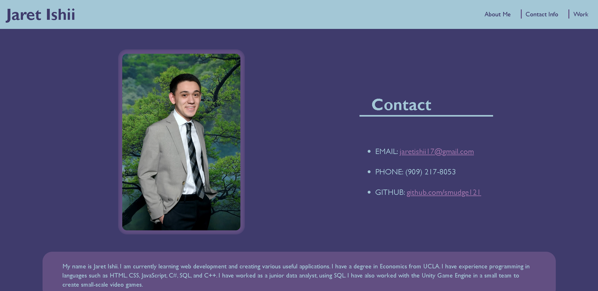

# Portfolio-Wesbsite

## Description

In this project I created a web based portfolio to show case and past web development and programming related works.  This portfolio website will serve as a basis to be built upon as I grow my web development skills and create various new applications.  Through the course of this project, I learned a lot about css and flexbox.  

## Usage

This portfolio is hosted at this link: https://smudge121.github.io/Portfolio-Website/ 
  

To view the source code, download the project from this git repository.  The HTML, css, and image files are available.

## Credits

1. Developed by Jaret Ishii
2. Color palette from: https://colorhunt.co/
3. Animated Text over Images tutorial: https://www.w3docs.com/snippets/css/how-to-display-an-animated-text-over-an-image-on-hover-using-only-css3.html

## License

MIT License